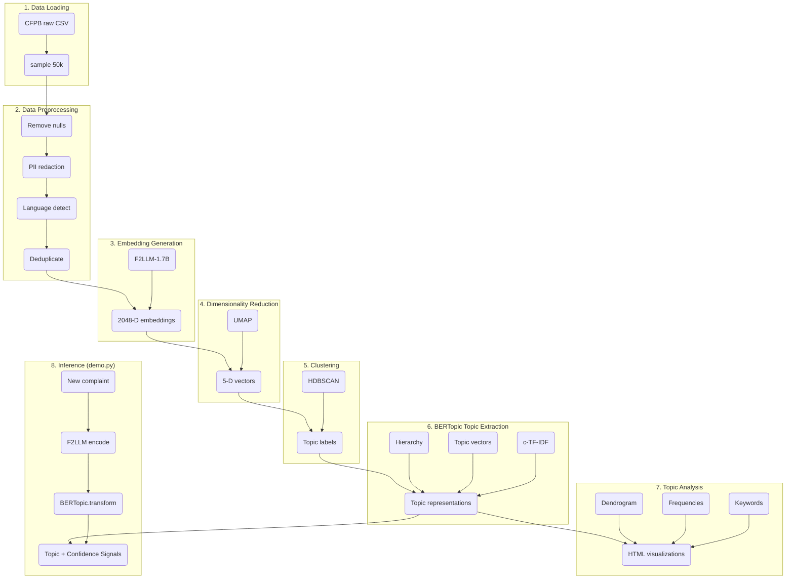

# BERTopic CFPB Complaint Analysis Pipeline

A modular, production-oriented topic modeling pipeline for the CFPB Consumer Complaint Database. Discovers complaint themes at scale using BERTopic with precomputed embeddings, UMAP dimensionality reduction, HDBSCAN clustering, and Gemini-powered topic labeling — with an interactive terminal demo for real-time inference.

---

## Business Problem

The Consumer Financial Protection Bureau (CFPB) receives millions of consumer complaints about financial products and services. Each complaint is a free-text narrative describing issues with mortgages, debt collection, credit reporting, identity theft, and more.

**The challenge**: Manual categorization is slow, inconsistent, and does not scale. Predefined product/issue taxonomies miss emerging themes. Analysts need a way to automatically discover complaint patterns without predefined categories.

## Business Value

- **Theme discovery**: Automatically surfaces complaint topics (e.g., "Identity Theft Fraud Reporting," "Debt Collection Verification Disputes") without predefined categories.
- **Emerging pattern detection**: New fraud schemes or recurring consumer pain points appear as distinct clusters, enabling proactive investigation.
- **Analyst efficiency**: Reduces thousands of complaints into a handful of interpretable topics with human-readable labels.
- **Reporting support**: Labeled topics can feed dashboards, trend analysis, and regulatory reporting.
- **Reproducibility**: The pipeline is fully scripted and version-controlled — no black-box notebook cells.

---

## Architecture



> PNG version: [docs/architecture.png](docs/architecture.png)

---

## Repository Structure

```
bertopic-project/
|
+-- main.py                        # CLI entry point: python main.py --step <name>
+-- demo.py                        # Interactive terminal demo for real-time inference
+-- app.py                         # Streamlit Web GUI dashboard
+-- config.yaml                    # Single source of truth (paths, params, methods)
+-- pyproject.toml                 # Dependencies, scripts, project metadata
+-- .gitignore
+-- README.md
+-- DEPLOYMENT.md                  # Deployment guide for Lightning AI / inference server
|
+-- src/                           # Python package — all pipeline logic
|   +-- config.py                  # Config loader, project root resolver, RunMetadata
|   +-- validators.py              # Shared validation utilities (file existence, column checks)
|   |
|   +-- preprocessing/             # Data loading, cleaning, sampling, deduplication
|   |   +-- clean.py               # PII redaction, language detection, word count
|   |   +-- preprocess.py          # Orchestration: load -> sample -> clean -> dedup -> save
|   |
|   +-- embedding/                 # Text-to-vector conversion
|   |   +-- generate.py            # SentenceTransformer model loading + batch encoding
|   |   +-- evaluate.py            # NN accuracy, top-k similarity, extreme pair analysis
|   |
|   +-- clustering/                # Dimensionality reduction + clustering
|   |   +-- reduce.py              # UMAP fitting + grid search tuning (trustworthiness, DBCV)
|   |   +-- cluster.py             # HDBSCAN fitting + grid search tuning (DBCV)
|   |
|   +-- topic_modeling/            # BERTopic integration + labeling
|   |   +-- fit.py                 # BERTopic with precomputed labels (BaseCluster) + centroids
|   |   +-- label.py               # Gemini-powered topic labeling (batching, retries, JSON)
|   |   +-- visualize.py           # Intertopic distance, hierarchy, topics over time
|   |
|   +-- inference/                 # Production inference (CPU-friendly)
|   |   +-- schemas.py             # TopicPrediction dataclass
|   |   +-- predict.py             # Centroid similarity + BERTopic.transform
|   |
|   +-- validation/                # Artifact integrity checks
|       +-- validate.py            # 6 check suites, 18+ individual checks
|
+-- scripts/
|   +-- compare_inference_methods.py   # GPU-only: compares centroid vs BERTopic on 12 test cases
|   +-- run_validation_checks.py       # Standalone validation runner
|
+-- tests/
|   +-- test_artifacts.py              # 19 unit tests for artifact loading + validation
|
+-- data/
|   +-- raw/complaints.csv             # Raw CFPB data (large, gitignored)
|   +-- processed/                     # Preprocessed CSVs (gitignored)
|
+-- artifacts/
|   +-- embeddings.npy                 # 2048-D corpus embeddings (training only)
|   +-- embeddings_umap.npy            # UMAP-reduced embeddings, 5-D (training only)
|   +-- cluster_labels.npy             # Raw HDBSCAN labels (pre-BERTopic renumbering)
|   +-- topic_centroids.npy            # Dict[topic_id -> mean embedding vector]
|   +-- topic_lookup.csv               # Topic ID -> Gemini-generated human-readable label
|   +-- labels.csv                     # Same mapping (validation cross-reference)
|   +-- model/                         # Saved BERTopic model (safetensors)
|       +-- config.json
|       +-- topics.json                # Keywords, sizes, representations per topic
|       +-- topic_embeddings.safetensors
|
+-- outputs/                           # Generated reports, plots, metadata
|   +-- cfpb_final_with_labeled_topics.csv
|   +-- run_metadata.json
|   +-- *.html                         # Intertopic distance, hierarchy, topics over time
|
+-- notebooks/                         # Reference notebooks (original exploration)
    +-- 00_preprocessing.ipynb
    +-- 01_embeddings_generation.ipynb
    +-- 02_embeddings_evaluation.ipynb
    +-- 03_umap.ipynb
    +-- 04_umap_tuning.ipynb
    +-- 05_hdbscan.ipynb
    +-- 06_bertopic_and_labels.ipynb
```

---

## Training Pipeline

The training pipeline runs **once, offline, on a GPU-capable machine**. Each step produces artifacts consumed by the next. Nothing here needs to be repeated at inference time.

```
Raw CSV (complaints.csv)
   |
   v
+---------------------------------------------------------------------+
| Step 1: Preprocessing                                               |
| ------------------------------------------------------------------- |
| load_raw_csv() -> sample 50,000 rows (random_seed from config)      |
| -> clean_cfpb_text(): PII redaction (XX/XX/YYYY -> [DATE],          |
|      XXXX -> [PROTECTED]), whitespace normalisation                  |
| -> lingua language detection -> deduplicate on text column           |
| -> bertopic_ready.csv (35,993 unique complaints)                    |
+---------------------------------------------------------------------+
   |
   v
+---------------------------------------------------------------------+
| Step 2: Embedding Generation                                        |
| ------------------------------------------------------------------- |
| SentenceTransformer(codefuse-ai/F2LLM-1.7B)                        |
| model.encode(documents, batch_size=2, convert_to_numpy=True)        |
| -> embeddings.npy  shape: (N, 2048)  dtype: float16                 |
+---------------------------------------------------------------------+
   |
   v
+---------------------------------------------------------------------+
| Step 3: UMAP Dimensionality Reduction                               |
| ------------------------------------------------------------------- |
| tune_umap(): grid search n_neighbors [10, 15, 30, 50]              |
|   -> score each by trustworthiness + downstream DBCV               |
| fit_umap(): reduce 2048-D -> 5-D with best n_neighbors             |
|   metric=cosine, min_dist=0.0, random_state=42                     |
| -> embeddings_umap.npy  shape: (N, 5)                              |
+---------------------------------------------------------------------+
   |
   v
+---------------------------------------------------------------------+
| Step 4: HDBSCAN Clustering                                         |
| ------------------------------------------------------------------- |
| tune_hdbscan(): grid search min_cluster_size x min_samples         |
|   -> score each configuration by DBCV                              |
|      (Density-Based Clustering Validation index)                   |
| fit_hdbscan(): final clustering with best params                   |
|   metric=euclidean, cluster_selection_method=eom                   |
| -> cluster_labels.npy  (raw HDBSCAN output, noise = -1)           |
+---------------------------------------------------------------------+
   |
   v
+---------------------------------------------------------------------+
| Step 5: BERTopic Fitting + Centroid Computation                    |
| ------------------------------------------------------------------- |
| BERTopic(                                                          |
|   embedding_model=None,           # embeddings already computed    |
|   umap_model=BaseDimensionalityReduction(),  # reduction done      |
|   hdbscan_model=BaseCluster(),    # clustering done                |
|   calculate_probabilities=False,             # not needed          |
| )                                                                  |
| .fit_transform(documents, embeddings=embeddings, y=cluster_labels) |
| -> renumbered topic IDs (largest cluster = Topic 0)               |
| -> c-TF-IDF keyword representations per topic                     |
| -> topic_centroids.npy: mean embedding vector per topic           |
|      (computed in original 2048-D space, NOT UMAP space)          |
| -> artifacts/model/ (BERTopic saved as safetensors)               |
+---------------------------------------------------------------------+
   |
   v
+---------------------------------------------------------------------+
| Step 6: Gemini Topic Labeling                                      |
| ------------------------------------------------------------------- |
| For each topic:                                                    |
|   prompt = c-TF-IDF keywords + 1 representative document          |
|   -> Gemini API -> structured JSON label                           |
|   -> retry with exponential backoff on failure                     |
| -> topic_lookup.csv  (topic_id -> "Identity Theft Fraud Reporting")|
| -> labels.csv        (same mapping, validation cross-reference)   |
| -> outputs/cfpb_final_with_labeled_topics.csv                     |
+---------------------------------------------------------------------+
   |
   v
+---------------------------------------------------------------------+
| Step 7: Visualization                                              |
| ------------------------------------------------------------------- |
| visualize_topics()       -> intertopic distance map (HTML)         |
| visualize_hierarchy()    -> topic hierarchy dendrogram (HTML)      |
| visualize_topics_over_time() -> topic evolution over time (HTML)  |
+---------------------------------------------------------------------+
```

---

## Inference Pipeline

Inference is **independent of the training pipeline**. It only needs three artifacts: `topic_centroids.npy`, `topic_lookup.csv`, and `artifacts/model/`. No GPU, no Gemini API, no retraining required.

The interactive demo (`demo.py`) implements this pipeline end-to-end.

```
New Complaint Text
        |
        v
+------------------------------------------------------------------+
| Preprocessing — clean_cfpb_text()                                |
| ---------------------------------------------------------------- |
| Same function used during training.                              |
| PII redaction: XX/XX/YYYY -> [DATE], XXXX -> [PROTECTED]        |
| Whitespace normalisation and strip                               |
+------------------------------------------------------------------+
        |
        v
+------------------------------------------------------------------+
| Embedding — SentenceTransformer.encode()                         |
| ---------------------------------------------------------------- |
| Model: codefuse-ai/F2LLM-1.7B                                   |
| Same model, same dtype (float16), same device_map as training   |
| Output: query vector  shape: (1, 2048)                          |
| Single encode() call — vector reused for both signals below     |
+------------------------------------------------------------------+
        |
        v
+------------------------------------------------------------------+
| Topic Assignment — BERTopic.transform([text])                    |
| ---------------------------------------------------------------- |
| BERTopic uses its saved c-TF-IDF representation to assign       |
| the complaint to the closest known topic.                        |
| Output: topic_id (integer)                                      |
+------------------------------------------------------------------+
        |
        v
+------------------------------------------------------------------+
| Confidence Signal — Embedding Similarity                          |
| ---------------------------------------------------------------- |
| cosine(query, centroid[topic_id])                               |
|                                                                  |
| Measures the geometric cosine similarity between the query      |
| embedding and the centroid of the predicted BERTopic topic.     |
+------------------------------------------------------------------+
        |
        v
+------------------------------------------------------------------+
| Label Lookup — topic_lookup.csv                                  |
| ---------------------------------------------------------------- |
| topic_id -> "Credit Report Payment Errors"                       |
| keywords  <- artifacts/model/topics.json                        |
| size      <- artifacts/model/topics.json                        |
+------------------------------------------------------------------+
        |
        v
+------------------------------------------------------------------+
| Result dict                                                      |
| ---------------------------------------------------------------- |
| {                                                                |
|   topic_id:        92,                                           |
|   label:           "Credit Report Payment Errors",              |
|   score:           0.630,   # cosine to predicted topic centroid|
|   keywords:        ["late", "payments", "paid", "time", ...],   |
|   size:            80,                                          |
|   low_confidence:  False,                                       |
| }                                                                |
+------------------------------------------------------------------+
```

### Reading the Confidence Signal

- **Embedding similarity** measures how close the complaint text is geometrically to the center of the assigned topic cluster.
- Values typically sit in the range `0.12 – 0.30` due to the semantic properties of the 2048-D F2LLM embeddings and centroid shrinkage.
- If similarity falls below **12%**, the complaint is flagged as low confidence (`low_confidence: True`), indicating it is likely a fringe case or doesn't fit any known topic cleanly.

---

## Interactive Demo & Web GUI

This project includes two separate interactive demo clients for real-time inference: a **Terminal CLI** (`demo.py`) and a **Streamlit Web GUI** (`app.py`). Both are designed to showcase model inference cleanly for portfolio presentations.

---

### 🖥️ Option A: Streamlit Web GUI (`app.py`)

A full interactive dashboard that runs inside your browser. It caches the model in GPU/CPU memory once and embeds interactive charts dynamically.

#### Launch

```bash
streamlit run app.py
```

#### GUI Features
* **Clickable Templates:** Quick-test buttons for common complaint scenarios (Identity Theft, Debt Collection, Mortgage).
* **Metric Cards & Badges:** Renders the predicted topic category, topic size, and keywords as visual tags.
* **Calibrated Progress Indicators:** Custom similarity bars mapped to the F2LLM embedding range.
* **Embedded Intertopic Diagrams:** Renders the interactive HTML cluster maps generated during training (`Intertopic Distance Map` & `Hierarchy Tree`) directly inside web page tabs.

---

### 📟 Option B: Terminal CLI (`demo.py`)

A styled terminal application using the `rich` library, ideal for quick terminal-based captures or LinkedIn screen records.

#### Launch

```bash
python demo.py
```

#### What it shows

```
╔══════════════════════════════════════════════════════════════════╗
║             CFPB Complaint Topic Analyzer            ║
║          BERTopic · F2LLM-1.7B · Cosine Similarity          ║
╚══════════════════════════════════════════════════════════════════╝

  ✓ Loaded: 87 topics · 36,842 training documents · codefuse-ai/F2LLM-1.7B · GPU

Enter a consumer complaint: My mortgage servicer incorrectly reported...

┌─ Complaint ─────────────────────────────────────────────────────┐
│ "My mortgage servicer incorrectly reported my payment as late"  │
└─────────────────────────────────────────────────────────────────┘

┌─ Predicted Topic ───────────────────────────────────────────────┐
│                                                                 │
│   Credit Report Payment Errors                                  │
│   Topic ID 92                                                   │
└─────────────────────────────────────────────────────────────────┘

┌─ Confidence Signals ────────────────────────────────────────────┐
│   Embedding similarity   █████████████░░░░░░░░   63.0%         │
└─────────────────────────────────────────────────────────────────┘

┌─ Top Keywords ──────────────────────────────────────────────────┐
│   ✓ late   ✓ payments   ✓ paid   ✓ time   ✓ report             │
│                                                                 │
│   Topic Documents: 80                                           │
└─────────────────────────────────────────────────────────────────┘
```

#### Client Features
* **Lazy artifact loading** — everything is loaded once and cached in memory; subsequent queries are instant.
* **Styled startup stats** — displays topic count, training document count, model name, and device.
* **Low-confidence warning** — if Embedding similarity falls below 12%, a `⚠ Low similarity` warning is displayed.
* **Graceful error handling** — missing files print a styled error message with the fix command, then exit cleanly.
* **Keyboard interrupt** — `Ctrl+C` exits gracefully at any point.

---

## Artifacts Explained

| Artifact | Produced By | Consumed By | Training | Inference | Safe to Delete After Training |
|---|---|---|---|---|---|
| `embeddings.npy` | Step 2 (embedding) | Step 3 (UMAP) | Yes | No | Yes |
| `embeddings_umap.npy` | Step 3 (UMAP) | Step 4 (HDBSCAN) | Yes | No | Yes |
| `cluster_labels.npy` | Step 4 (HDBSCAN) | Step 5 (BERTopic) | Yes | No | Yes — raw HDBSCAN output; renumbered IDs live in centroids |
| `topic_centroids.npy` | Step 5 (BERTopic) | Inference | Yes | **Yes** | No — required for inference |
| `topic_lookup.csv` | Step 6 (Gemini) | Inference, Validation | Yes | **Yes** | No — required for inference |
| `labels.csv` | Step 6 (Gemini) | Validation | Yes | No | Yes — redundant with lookup |
| `model/` (BERTopic) | Step 5 (BERTopic) | Inference (transform), Visualization | Yes | **Yes** | No — required for demo inference |
| `model/topics.json` | Step 5 (BERTopic) | Demo (keywords, sizes) | Yes | **Yes** | No — required for demo |

---

## Project Lifecycle

```
TRAINING (offline, GPU required)
Run once on a GPU-capable machine. Produces all artifacts.
Steps: preprocessing -> embedding -> umap -> clustering ->
       topic_modeling -> labeling -> visualize
    |
    v
ARTIFACTS (minimum required set for inference)
topic_centroids.npy | topic_lookup.csv | artifacts/model/
    |
    v
INFERENCE / DEMO (CPU-friendly, no retraining)
python demo.py
  -> embed complaint -> BERTopic.transform -> two confidence signals
  -> topic label, keywords, size
```

---

## Design Philosophy

This project intentionally avoids unnecessary complexity. Key principles:

- **No over-engineering**: The pipeline does exactly what it needs to and no more. Each module has a single responsibility.
- **Readable modular code**: Each file is under 150 lines. Functions are short and focused. Type hints everywhere.
- **Configuration-driven**: All paths, parameters, and methods live in `config.yaml`. No hardcoded values in source code.
- **Minimal dependencies**: Only what is actually used. No `mlflow`, `dvc`, `kubeflow`, or orchestration frameworks.
- **Clear separation**: Training and inference are independent code paths. Training is destructive; inference is read-only.
- **Inference does not require Gemini**: Labels are precomputed. No API calls at inference time.
- **Preprocessing parity**: `demo.py` calls the exact same `clean_cfpb_text()` function used during training — no embedding mismatch.

---

## Engineering Decisions

### Why BERTopic?

BERTopic was chosen over LDA, NMF, or Top2Vec because:
- It produces interpretable topic representations via c-TF-IDF.
- It integrates with modern sentence embeddings (any SentenceTransformer model).
- It supports precomputed clustering via `BaseCluster`, enabling independent tuning of UMAP and HDBSCAN.
- It provides built-in visualization (intertopic distance, hierarchy, topics over time).

### Why SentenceTransformer embeddings?

SentenceTransformer models produce dense, semantically meaningful vectors that capture complaint similarity better than bag-of-words or TF-IDF representations. The chosen model (`codefuse-ai/F2LLM-1.7B`) produces 2048-D embeddings with strong semantic separation, validated via nearest-neighbor accuracy against CFPB product/issue labels.

### Why UMAP before clustering?

UMAP reduces 2048-D embeddings to 5 dimensions before clustering. This is necessary because HDBSCAN's density-based algorithm degrades in high-dimensional spaces (curse of dimensionality). UMAP preserves local neighborhood structure while removing noise dimensions, making clusters more separable.

### Why HDBSCAN instead of KMeans?

- HDBSCAN does not require specifying the number of clusters in advance — it discovers the natural cluster structure.
- It handles noise: complaints that do not fit any cluster are labeled as outliers (topic -1) rather than being force-assigned to an arbitrary cluster.
- It can detect clusters of varying density, which is expected in real-world complaint data.

### Why precomputed clustering?

BERTopic normally runs UMAP + HDBSCAN internally. This project runs them independently and passes the labels into BERTopic via `BaseCluster`. This allows:

- **Independent tuning**: UMAP and HDBSCAN hyperparameters are optimized via grid search with DBCV before BERTopic is ever involved.
- **Validation**: Cluster quality can be assessed independently of topic modeling.
- **Reproducibility**: The clustering step is decoupled and can be re-run without re-fitting BERTopic.

### Why are centroids computed in original embedding space, not UMAP space?

Topic centroids are mean vectors in the **original 2048-D embedding space**, not in UMAP's 5-D space. UMAP's non-linear projection is not reliably invertible for out-of-distribution inputs, so UMAP coordinates cannot be used for cosine similarity at inference time. Embedding-space centroids are stable and interpretable.

### Why BERTopic as the primary inference method in the demo?

The demo uses `BERTopic.transform()` as the primary topic assignment method, with centroid similarity used only as a secondary confidence signal. BERTopic's c-TF-IDF matching captures keyword-level semantics rather than just geometric proximity, which produces more interpretable topic assignments for financial complaint text.

---

## Trade-offs / Decisions Not Taken

### MMR (Maximal Marginal Relevance) for topic representation

BERTopic supports MMR to diversify c-TF-IDF keywords by reducing redundancy. This was evaluated but not adopted because:

- The current c-TF-IDF keywords already produce clean, interpretable topic representations (see Topic 0: `identity, theft, fraudulent, accounts, victim`).
- Gemini receives representative documents in addition to keywords, providing context beyond the keyword list.
- MMR adds complexity to the pipeline without measurable improvement in Gemini's labeling quality.
- Simpler pipeline is easier to maintain and debug.

### BERTopic's RepresentationModel abstraction

BERTopic provides a `RepresentationModel` interface for custom label generation. This was not used because a custom `GeminiLabeler` class provides:

- **Batching**: Topics are labeled in configurable batches (default 15) to stay within API limits.
- **Retries**: Automatic retry with exponential backoff on API failures.
- **JSON validation**: Gemini returns structured JSON that is validated before use.
- **Prompt customization**: The prompt can be tuned independently of BERTopic's internals.
- **Deterministic outputs**: Each topic is labeled independently; no shared state between calls.

### Topic reduction

BERTopic supports merging similar topics after fitting. This was intentionally not applied because:

- Preserving topic granularity allows analysts to see fine-grained complaint patterns.
- Similar topics can be merged downstream (in dashboards or reporting) without losing information.
- The current number of topics (~20) is already manageable for human review.

---

## Lessons Learned

### Modular ML pipelines matter

The original exploration was done in Jupyter notebooks. Refactoring into a modular `src/` package with a CLI entry point made the pipeline reproducible, testable, and deployable. Each module can be developed, tested, and debugged independently.

### Separating offline and online stages

Training (offline) and inference (online) have fundamentally different requirements. Training needs GPU, large memory, and all data. Inference needs low latency, CPU compatibility, and minimal dependencies. Designing for this separation from the start prevents architectural debt.

### Artifact management is infrastructure

Artifacts are the contract between training and inference. Versioning, validation, and documentation of artifacts is as important as the ML code itself. The validation module (`src/validation/validate.py`) checks artifact integrity before inference runs.

### Reproducibility requires discipline

- `config.yaml` captures every parameter — no magic numbers in code.
- `RunMetadata` records the full config snapshot and execution context.
- Random seeds are set explicitly in config.
- The pipeline is fully scripted — no manual steps.

### Demo quality matters as much as model quality

A technically correct model that is poorly presented loses its impact. The demo was redesigned from a confusing side-by-side method comparison into a clean vertical layout with a single authoritative prediction and two clearly labelled confidence signals. The distinction between "BERTopic similarity" and "Embedding similarity" tells a more useful story than "methods agree / disagree."

### Deployment considerations shape architecture

Designing for deployment from the start (rather than as an afterthought) influenced every major decision: config-driven paths, artifact validation, and separation of training and inference code paths.

---

## Future Improvements

- **Online learning**: Incrementally update centroids as new complaints arrive without full retraining.
- **REST API**: Wrap the inference pipeline in a FastAPI endpoint for production serving.
- **CI/CD**: Add GitHub Actions for automated testing and artifact validation.
- **Monitoring**: Track prediction drift over time — do new complaints map to existing topics or form new patterns?
- **Multi-language support**: Extend preprocessing to handle non-English complaints (lingua-language-detector is already integrated).

---

## Installation

### Prerequisites

- Python >= 3.12
- pip

### Setup

```bash
cd bertopic-project
python -m venv .venv
.venv\Scripts\activate      # Windows
source .venv/bin/activate    # Linux/Mac
pip install -e ".[dev]"
```

### Environment Variables

| Variable | Required For | Description |
|---|---|---|
| `GEMINI_API_KEY` | Topic labeling (Step 6) | Google Gemini API key (set in `.env` file) |
| `HF_TOKEN` | Model download | Hugging Face token (optional, for rate limits) |

---

## Configuration

All configuration lives in `config.yaml`. Key sections:

```yaml
paths:
  embeddings: artifacts/embeddings.npy
  cluster_labels: artifacts/cluster_labels.npy
  topic_centroids: artifacts/topic_centroids.npy
  topic_lookup: artifacts/topic_lookup.csv
  bertopic_model_dir: artifacts/model

umap:
  final:
    n_neighbors: 15
    n_components: 5
    min_dist: 0.0
    metric: cosine
    random_state: 42
  tuning:
    n_neighbors: [10, 15, 30, 50]
    sample_size: 10000

hdbscan:
  final:
    metric: euclidean
    cluster_selection_method: eom
  tuning:
    min_cluster_size: [10, 15, 25, 40, 60]
    min_samples: [5, 10, 15]

bertopic:
  calculate_probabilities: false
  serialization: safetensors

embedding:
  model_name: codefuse-ai/F2LLM-1.7B
  torch_dtype: float16
  device_map: auto
```

---

## How to Run

### Interactive Demo (recommended starting point)

```bash
python demo.py
```

Loads all artifacts, then prompts for complaint text in an interactive loop. Displays the predicted topic, two confidence signals, top keywords, and topic size. Press `Ctrl+C` to exit.

### Validation (read-only, safe)

```bash
python main.py --step validate
python -m pytest tests/ -v
```

### Programmatic Inference

```python
from src.inference.predict import predict
from src.config import load_config

config = load_config()

complaints = [
    "Someone opened a credit card in my name without permission",
    "I demand validation of this debt under the FDCPA",
    "My mortgage payment was not credited correctly",
]

for text in complaints:
    results = predict(text, config, method="centroid_similarity")
    best = results[0]
    print(f"Complaint: {text[:55]}...")
    print(f"  -> Topic {best.topic_id}: {best.label} (score={best.score:.4f})")
```

Expected output:
```
Complaint: Someone opened a credit card in my name without per...
  -> Topic 0: Identity Theft Fraud Reporting (score=0.8102)
```

### Full Training Pipeline

> **Warning**: Overwrites existing artifacts. Only run if you intend to retrain from scratch.

```bash
python main.py --step all
```

### Individual Training Steps

```bash
python main.py --step preprocessing
python main.py --step embedding
python main.py --step umap
python main.py --step clustering
python main.py --step topic_modeling
python main.py --step labeling          # requires GEMINI_API_KEY
python main.py --step visualize
python main.py --step validate
python main.py --step inference
```

---

## Dataset

- **Source**: CFPB Consumer Complaint Database
- **Raw file**: `data/raw/complaints.csv`
- **Sample**: 50,000 complaints (randomly sampled, verified to match original product distribution)
- **Deduplicated**: 35,993 unique complaint narratives after removing exact duplicates
- **Text column**: `Consumer complaint narrative`
- **Language**: ~100% English (lingua-language-detector verified)

---

## Critical Design Note: Cluster ID Scheme

This pipeline uses **precomputed** clustering — HDBSCAN is fit once outside of BERTopic, and its labels are passed into BERTopic via `BaseCluster` rather than letting BERTopic re-cluster. This allows UMAP/HDBSCAN hyperparameters to be tuned and validated independently using DBCV before topic modeling runs.

**Important**: `cluster_labels.npy` on disk stores the **raw HDBSCAN output** (not renumbered). BERTopic renumbers topics by descending cluster size during `fit_transform()` (largest cluster becomes Topic `0`, etc.), but the renumbered labels are only kept in memory and used to compute `topic_centroids.npy`. The centroids are keyed by these renumbered IDs, and `topic_lookup.csv` maps the same renumbered IDs to labels.

This means `cluster_labels.npy` (raw HDBSCAN IDs) and `topic_centroids.npy` (renumbered IDs) use **different ID schemes**. The centroids and lookup table are the authoritative source for inference; `cluster_labels.npy` is only needed to reproduce or debug the raw clustering output.

---

## Known Issues

### `--step preprocessing` typo in `main.py`

The step key for preprocessing in `STEP_MAP` inside `main.py` is `"pring"` instead of `"preprocessing"`. Running `python main.py --step preprocessing` will report "Unknown step". As a workaround, run `python main.py --step all` to execute the full pipeline, or fix the key directly in `main.py`.

### `calculate_probabilities: false` — BERTopic scores are geometric, not probabilistic

`BERTopic.transform()` does not return meaningful topic probabilities when `calculate_probabilities: false` (the current setting). The confidence signals displayed in `demo.py` are therefore computed as **cosine similarity** values, not probabilities. This is clearly labelled in the demo UI. If true probability scores are needed, set `calculate_probabilities: true` in `config.yaml` and re-run Step 5 (`topic_modeling`).
